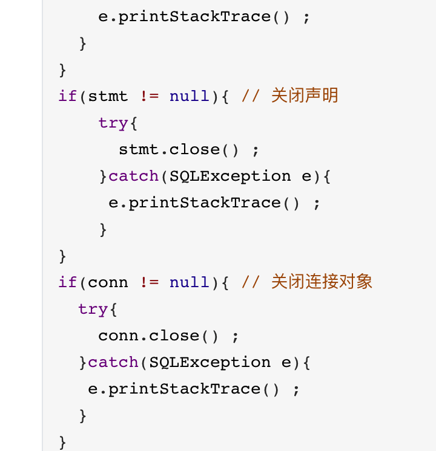

# 面向对象特征
封装，继承，多态和抽象
1. 封装
封装给对象提供了隐藏内部特性和行为的能力。对象提供一些能被其他对象访问的方法
来改
变它内部的数据。在 Java 当中，有 3 种修饰符： public， private 和 protected。每一
种修饰符
给其他的位于同一个包或者不同包下面对象赋予了不同的访问权限。
下面列出了使用封装的一些好处：
通过隐藏对象的属性来保护对象内部的状态。
提高了代码的可用性和可维护性，因为对象的行为可以被单独的改变或者是扩展。
禁止对象之间的不良交互提高模块化
2. 继承
继承给对象提供了从基类获取字段和方法的能力。继承提供了代码的重用行，也可以在
不修改类的情况下给现存的类添加新特性。
3. 多态
多态是编程语言给不同的底层数据类型做相同的接口展示的一种能力。一个多态类型上
的操作可以应用到其他类型的值上面。
4. 抽象
抽象是把想法从具体的实例中分离出来的步骤，因此，要根据他们的功能而不是实现细
节来创建类。 Java 支持创建只暴漏接口而不包含方法实现的抽象的类。这种抽象技术
的主要目的是把类的行为和实现细节分离开。

# final, finally, finalize 的区别
1. final
修饰符（关键字）如果一个类被声明为final，意味着它不能再派生出新的子类，不能作
为父类被继承。因此一个类不能既被声明为 abstract的，又被声明为final的。将变量或
方法声明为final，可以保证它们在使用中不被改变。被声明为final的变量必须在声明时
给定初值，而在以后的引用中只能读取，不可修改。被声明为final的方法也同样只能使
用，不能重载。
2. finally
在异常处理时提供 finally 块来执行任何清除操作。如果抛出一个异常，那么相匹配的
catch 子句就会执行，然后控制就会进入 finally 块（如果有的话）。
3. finalize
方法名。Java 技术允许使用 finalize() 方法在垃圾收集器将对象从内存中清除出去之前
做必要的清理工作。这个方法是由垃圾收集器在确定这个对象没有被引用时对这个对象
调用的。它是在 Object 类中定义的，因此所有的类都继承了它。子类覆盖 finalize() 方
法以整理系统资源或者执行其他清理工作。finalize() 方法是在垃圾收集器删除对象之前
对这个对象调用的。

# int 和 Integer 有什么区别
int 是基本数据类型
Integer是其包装类，注意是一个类。
为什么要提供包装类呢？？？
一是为了在各种类型间转化，通过各种方法的调用。否则 你无法直接通过变量转化。
比如，现在int要转为String

```java
int a=0;
String result=Integer.toString(a);
```
在java中包装类，比较多的用途是用在于各种数据类型的转化中。
我写几个demo
```java
//通过包装类来实现转化的
int num=Integer.valueOf("12");
int num2=Integer.parseInt("12");
double num3=Double.valueOf("12.2");
double num4=Double.parseDouble("12.2");
//其他的类似。通过基本数据类型的包装来的valueOf和parseXX来实现String转为XX
String a=String.valueOf("1234");//这里括号中几乎可以是任何类型
String b=String.valueOf(true);
String c=new Integer(12).toString();//通过包装类的toString()也可以
String d=new Double(2.3).toString();
```
再举例下。比如我现在要用泛型
```java
List<Integer> nums;
```
这里<>需要类。如果你用int。它会报错的。

# 重载和重写的区别
- override（重写）
1. 方法名、参数、返回值相同。
2. 子类方法不能缩小父类方法的访问权限。
3. 子类方法不能抛出比父类方法更多的异常(但子类方法可以不抛出异常)。
4. 存在于父类和子类之间。
5. 方法被定义为final不能被重写。
- overload（重载）
1. 参数类型、个数、顺序至少有一个不相同。
2. 不能重载只有返回值不同的方法名。
3. 存在于父类和子类、同类中。

| 区别 | 重载                               | 重写                                   |
| ---- | :--------------------------------- | -------------------------------------- |
| 英文 | Overloading                        | Overiding                              |
| 定义 | 方法名称相同，参数的类型或个数不同 | 方法名称、参数类型、返回值类型全部相同 |
| 权限 | 对权限没要求                       | 被重写的方法不能拥有更严格的权限       |
| 范围 | 发生在一个类中                     | 发生在继承类中                         |

# 抽象类和接口有什么区别
接口是公开的，里面不能有私有的方法或变量，是用于让别人使用的，而抽象类是可以有私
有方法或私有变量的，
另外，实现接口的一定要实现接口里定义的所有方法，而实现抽象类可以有选择地重写需要
用到的方法，一般的应用里，最顶级的是接口，然后是抽象类实现接口，最后才到具体类实
现。
还有，接口可以实现多重继承，而一个类只能继承一个超类，但可以通过继承多个接口实现
多重继承，接口还有标识（里面没有任何方法，如Remote接口）和数据共享（里面的变量
全是常量）的作用。
# 说说反射的用途及实现
Java反射机制主要提供了以下功能：在运行时构造一个类的对象；判断一个类所具有的成
员变量和方法；调用一个对象的方法；生成动态代理。反射最大的应用就是框架
Java反射的主要功能：

1. 确定一个对象的类

2. 取出类的modifiers,数据成员,方法,构造器,和超类.

3. 找出某个接口里定义的常量和方法说明.

4. 创建一个类实例,这个实例在运行时刻才有名字(运行时间才生成的对象).

5. 取得和设定对象数据成员的值,如果数据成员名是运行时刻确定的也能做到.

6. 在运行时刻调用动态对象的方法.

7. 创建数组,数组大小和类型在运行时刻才确定,也能更改数组成员的值.
反射的应用很多，很多框架都有用到
  spring 的 ioc/di 也是反射…
javaBean和jsp之间调用也是反射…
   struts的 FormBean 和页面之间…也是通过反射调用…
   JDBC 的 classForName()也是反射…
   hibernate的 find(Class clazz) 也是反射…
   反射还有一个不得不说的问题，就是性能问题，大量使用反射系统性能大打折扣。怎么使用
   使你的系统达到最优就看你系统架构和综合使用问题啦，这里就不多说了。
   来源：http://uule.iteye.com/blog/1423512
   
   # 说说自定义注解的场景及实现
   （此题自由发挥，就看你对注解的理解了!==）登陆、权限拦截、日志处理，以及各种Java
框架，如Spring，Hibernate，JUnit 提到注解就不能不说反射，Java自定义注解是通过运行
   时靠反射获取注解。实际开发中，例如我们要获取某个方法的调用日志，可以通过
   AOP（动态代理机制）给方法添加切面，通过反射来获取方法包含的注解，如果包含日志
   注解，就进行日志记录。
   # HTTP 请求的 GET 与 POST 方式的区别
   GET方法会把名值对追加在请求的URL后面。因为URL对字符数目有限制，进而限制了用在
   客户端请求的参数值的数目。并且请求中的参数值是可见的，因此，敏感信息不能用这种方
   式传递。
   POST方法通过把请求参数值放在请求体中来克服GET方法的限制，因此，可以发送的参数
   的数目是没有限制的。最后，通过POST请求传递的敏感信息对外部客户端是不可见的。
   参考：https://www.cnblogs.com/wangli­66/p/5453507.html
   # session 与 cookie 区别
   cookie 是 Web 服务器发送给浏览器的一块信息。浏览器会在本地文件中给每一个 Web 服
   务
   器存储 cookie。以后浏览器在给特定的 Web 服务器发请求的时候，同时会发送所有为该服
   务器存储的 cookie。下面列出了 session 和 cookie 的区别：
   无论客户端浏览器做怎么样的设置，session都应该能正常工作。客户端可以选择禁用
   cookie，
   但是， session 仍然是能够工作的，因为客户端无法禁用服务端的 session。
   # JDBC 流程
   1. 加载JDBC驱动程序：
      在连接数据库之前，首先要加载想要连接的数据库的驱动到JVM（Java虚拟机），
      这通过java.lang.Class类的静态方法forName(String className)实现。
      例如：
   
   ```java
   try{
//加载MySql的驱动类
   Class.forName("com.mysql.jdbc.Driver") ;
   }catch(ClassNotFoundException e){
   System.out.println("找不到驱动程序类 ，加载驱动失败！");
   e.printStackTrace() ;
   }
   ```
   
   
   
​	成功加载后，会将Driver类的实例注册到DriverManager类中。
   2. 提供JDBC连接的URL

     - 连接URL定义了连接数据库时的协议、子协议、数据源标识。
   
     - 书写形式：协议：子协议：数据源标识
   
    协议：在JDBC中总是以jdbc开始 子协议：是桥连接的驱动程序或是数据库管理系统名称。
       数据源标识：标记找到数据库来源的地址与连接端口。
       例如：
   
   ```java
   jdbc:mysql://localhost:3306/test?
   useUnicode=true&characterEncoding=gbk;useUnicode=true;（MySql的连接URL）
   
   ```

   表示使用Unicode字符集。如果characterEncoding设置为 gb2312或GBK，本参数必须设置
   为true 。characterEncoding=gbk：字符编码方式。

   

   3. 创建数据库的连接

      要连接数据库，需要向java.sql.DriverManager请求并获得Connection对象， 该对象就
      代表一个数据库的连接。
      使用DriverManager的getConnectin(String url , String username , String password )方
      法传入指定的欲连接的数据库的路径、数据库的用户名和 密码来获得。
      例如： //连接MySql数据库，用户名和密码都是root.
      
   ```java
      String url = "jdbc:mysql://localhost:3306/test" ;
      String username = "root" ;
   String password = "root" ;
      try{
      Connection con = DriverManager.getConnection(url , username , password
   ) ;
      }catch(SQLException se){
      System.out.println("数据库连接失败！");
   se.printStackTrace() ;
   ```
   
      
   
   4. 创建一个Statement
      •要执行SQL语句，必须获得java.sql.Statement实例，Statement实例分为以下3 种类型：
      1、执行静态SQL语句。通常通过Statement实例实现。
      2、执行动态SQL语句。通常通过PreparedStatement实例实现。
      3、执行数据库存储过程。通常通过CallableStatement实例实现。
      具体的实现方式：
   
      ```java
      Statement stmt = con.createStatement() ; PreparedStatement pstmt =
      con.prepareStatement(sql) ; CallableStatement cstmt = con.prepareCall("{CALL
      demoSp(? , ?)}") ;
      ```
   
   5.执行SQL语句
      Statement接口提供了三种执行SQL语句的方法：executeQuery 、executeUpdate 和execute
      1、ResultSet executeQuery(String sqlString)：执行查询数据库的SQL语句 ，返回一个结
      果集（ResultSet）对象。
      2、int executeUpdate(String sqlString)：用于执行INSERT、UPDATE或 DELETE语句以及
      SQL DDL语句，如：CREATE TABLE和DROP TABLE等
      3、execute(sqlString):用于执行返回多个结果集、多个更新计数或二者组合的 语句。 具体
      实现的代码：
      ResultSet rs = stmt.executeQuery(“SELECT * FROM …”) ; int rows =
      stmt.executeUpdate(“INSERT INTO …”) ; boolean flag = stmt.execute(String sql) ;
   6. 处理结果
      两种情况：
      1、执行更新返回的是本次操作影响到的记录数。
      2、执行查询返回的结果是一个ResultSet对象。
      • ResultSet包含符合SQL语句中条件的所有行，并且它通过一套get方法提供了对这些 行中
      数据的访问。
      • 使用结果集（ResultSet）对象的访问方法获取数据：
      ```java
      while(rs.next()){
      String name = rs.getString(“name”) ;
      String pass = rs.getString(1) ; // 此方法比较高效
      }
      ```
      （列是从左到右编号的，并且从列1开始）
   7. 关闭JDBC对象
      操作完成以后要把所有使用的JDBC对象全都关闭，以释放JDBC资源，关闭顺序和声 明顺
      序相反：
      1、关闭记录集
      2、关闭声明
      3、关闭连接对象
      ```java
      if(rs != null){ // 关闭记录集
        try{
          rs.close() ;
        }catch(SQLException e){
          e.printStackTrace() ;
        }
      }
      if(stmt != null){ // 关闭声明
          try{
            stmt.close() ;
          }catch(SQLException e){
           e.printStackTrace() ;
          }
      }
      if(conn != null){ // 关闭连接对象
        try{
        	conn.close() ;
        }catch(SQLException e){
       	 e.printStackTrace() ;
        }
      }
   
      ```

