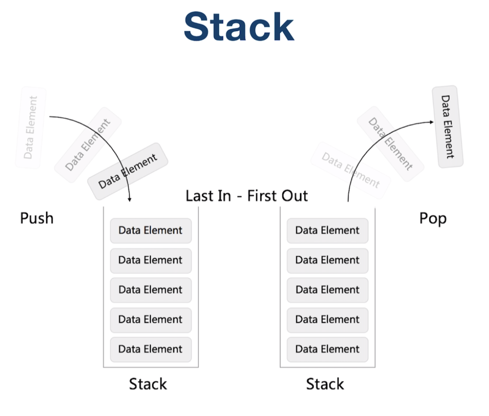
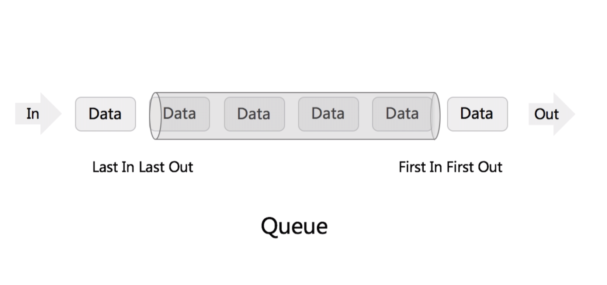
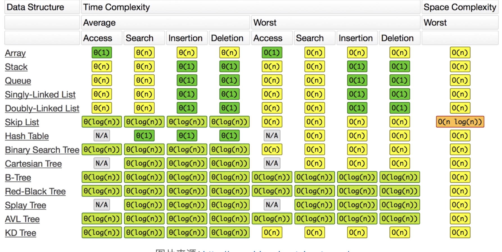

# 堆栈和队列
## 概念

1. Stack - First In Last Out (FILO) 
   - Array or Linked List 
2. Queue - First In First Out (FIFO)
   - Array or Doubly Linked List





**常见数据结构时间复杂度**



## 实战题

#### [ 有效的括号](https://leetcode-cn.com/problems/valid-parentheses/)(leetcode-20)

**示例:** <br>
输入: "()[]{}"   输出: true <br>
输入: "([)]"      输出: false

```java
  public static boolean isValid(String s) {
    Stack<Character> stack = new Stack<>();
    HashMap<Character, Character> parenMap = new HashMap<Character, Character>() {{
      put(')', '(');
      put(']', '[');
      put('}', '{');
    }};
    for (char c : s.toCharArray()) {
      if (!parenMap.containsKey(c)) {
        stack.push(c);
      } else if (stack.isEmpty() || !parenMap.get(c).equals(stack.pop())) {
        return false;
      }
    }
    return stack.isEmpty();
  }
```

####  [用栈实现队列](https://leetcode-cn.com/problems/implement-queue-using-stacks/)(leetcode-232)

push(x) -- 将一个元素放入队列的尾部。
pop() -- 从队列首部移除元素。
peek() -- 返回队列首部的元素。
empty() -- 返回队列是否为空。

**示例:**

```java
MyQueue queue = new MyQueue();

queue.push(1);
queue.push(2);  
queue.peek();  // 返回 1
queue.pop();   // 返回 1
queue.empty(); // 返回 false
```


说明:

你只能使用标准的栈操作 -- 也就是只有 push to top, peek/pop from top, size, 和 is empty 操作是合法的。
你所使用的语言也许不支持栈。你可以使用 list 或者 deque（双端队列）来模拟一个栈，只要是标准的栈操作即可。
假设所有操作都是有效的 （例如，一个空的队列不会调用 pop 或者 peek 操作）。

```java
class MyQueue {

    Stack<Integer> inStack;

    Stack<Integer> outStack;

    /**
     * Initialize your data structure here.
     */
    public MyQueue() {
      inStack = new Stack<>();
      outStack = new Stack<>();
    }

    /**
     * Push element x to the back of queue.
     */
    public void push(int x) {
      inStack.push(x);
    }

    /**
     * Removes the element from in front of queue and returns that element.
     */
    public int pop() {
      if (outStack.isEmpty()) {
        while (!inStack.isEmpty()) {
          outStack.push(inStack.pop());
        }
      }
      return outStack.pop();
    }

    /**
     * Get the front element.
     */
    public int peek() {
      if (outStack.isEmpty()) {
        while (!inStack.isEmpty()) {
          outStack.push(inStack.pop());
        }
      }
      return outStack.peek();
    }

    /**
     * Returns whether the queue is empty.
     */
    public boolean empty() {
      return outStack.isEmpty() && inStack.isEmpty();
    }
  }
```

###[ 数据流中的第K大元素](https://leetcode-cn.com/problems/kth-largest-element-in-a-stream/) (leetcode-703)

设计一个找到数据流中第K大元素的类（class）。注意是排序后的第K大元素，不是第K个不同的元素。

你的 KthLargest 类需要一个同时接收整数 k 和整数数组nums 的构造器，它包含数据流中的初始元素。每次调用 KthLargest.add，返回当前数据流中第K大的元素。

示例:

```java
int k = 3;
int[] arr = [4,5,8,2];
KthLargest kthLargest = new KthLargest(3, arr);
kthLargest.add(3);   // returns 4
kthLargest.add(5);   // returns 5
kthLargest.add(10);  // returns 5
kthLargest.add(9);   // returns 8
kthLargest.add(4);   // returns 8说明:
你可以假设 nums 的长度≥ k-1 且k ≥ 1。
```

解答:

```java
 class KthLargest {

    final PriorityQueue<Integer> q;
    final int k;

    public KthLargest(int k, int[] nums) {
      this.k = k;
      q = new PriorityQueue<>(k);
      for (int num : nums) {
        add(num);
      }
    }

    public int add(int val) {
      if (q.size() < k) {
        q.offer(val);
      } else if (q.peek() < val) {
        q.poll();
        q.offer(val);
      }
      return q.peek();
    }
  }
```

### [滑动窗口最大值](https://leetcode-cn.com/problems/sliding-window-maximum/)(leetcode-239)

给定一个数组 nums，有一个大小为 k 的滑动窗口从数组的最左侧移动到数组的最右侧。你只可以看到在滑动窗口内的 k 个数字。滑动窗口每次只向右移动一位。

返回滑动窗口中的最大值。

 

示例:

输入: nums = [1,3,-1,-3,5,3,6,7], 和 k = 3
输出: [3,3,5,5,6,7] 
解释: 

```
  滑动窗口的位置                最大值

---------------               -----

[1  3  -1] -3  5  3  6  7       3
 1 [3  -1  -3] 5  3  6  7       3
 1  3 [-1  -3  5] 3  6  7       5
 1  3  -1 [-3  5  3] 6  7       5
 1  3  -1  -3 [5  3  6] 7       6
 1  3  -1  -3  5 [3  6  7]      7
```


提示：

你可以假设 k 总是有效的，在输入数组不为空的情况下，1 ≤ k ≤ 输入数组的大小。

 ```java

 ```


