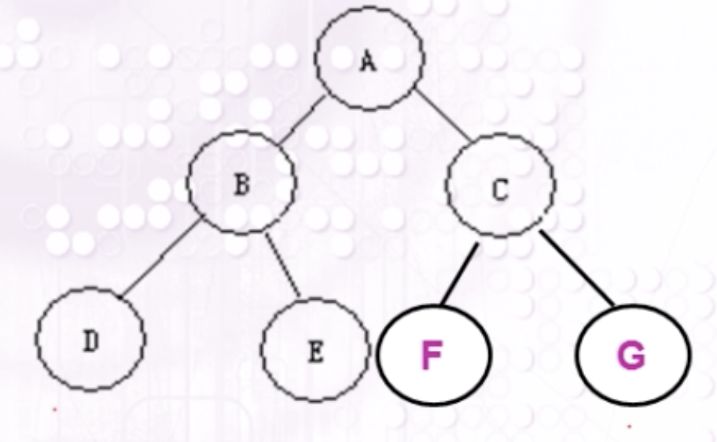

# 基本知识
## 二叉树
**二叉树**：二叉树是有限个结点的集合，这个集合或者是空集，或者是由一个根结点和两株互不相交的二叉树组成，其中一株叫根的做左子树，另一棵叫做根的右子树。

**二叉树的性质**：

- 性质1：在二叉树中第 i 层的结点数最多为 $$2^{(i-1)}(i>=1)$$
- 性质2：高度为k的二叉树其结点总数最多为$2^k－1（ k >= 1）$
- 性质3：对任意的非空二叉树 T ，如果叶结点的个数为 $$n_0$$，而其度为 2 的结点数为$$n_2$$，则：$$n_0 = n_2 + 1$$ 

**满二叉树**：深度为k且有$2^k －1个$结点的二叉树称为满二叉树

**完全二叉树**：

如果在一棵深度为$k (k≥1)$的满二叉树上删去第$k$层上最右的连续$j (0≤j≤2k-1)$个节点，就得到一棵深度为$k$的完全二叉树。(除最后一层外，每一层上的节点数均达到最大值；在最后一层上只缺少右边的若干结点）)

- 性质4：具有 n 个结点的完全二叉树的深度为 $log_2n + 1$

注意：

仅有前序和后序遍历，不能确定一个二叉树，必须有中序遍历的结果

## 二叉排序树

