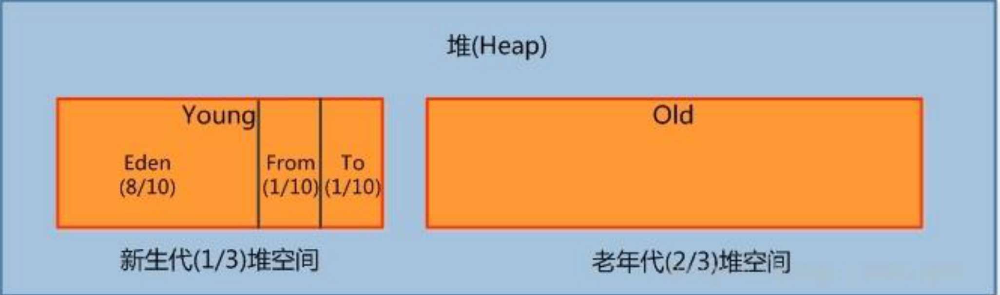
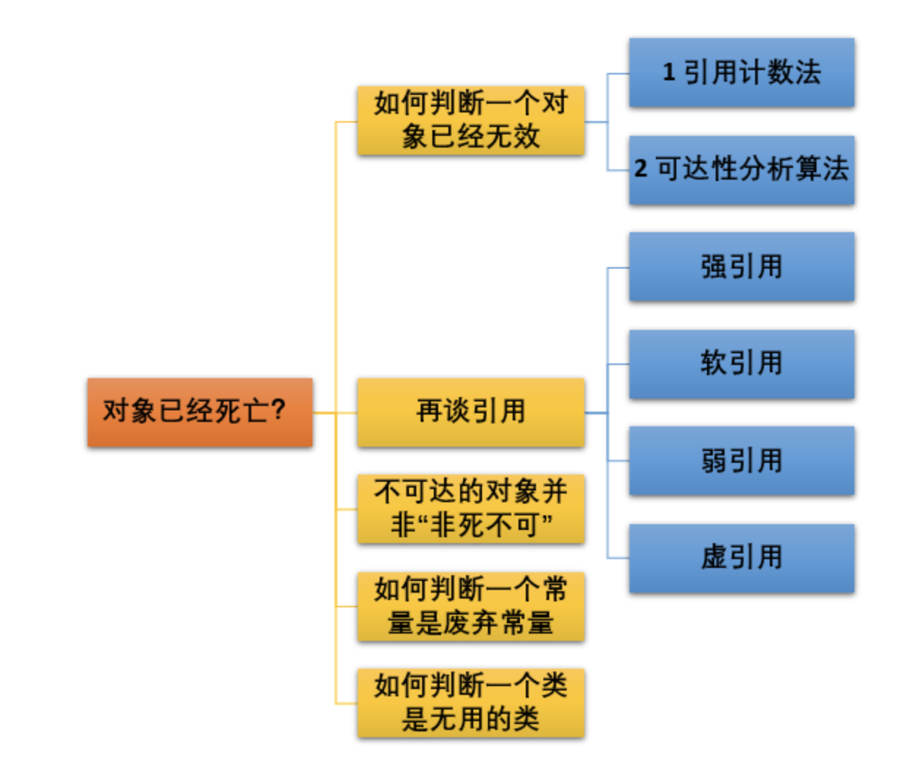
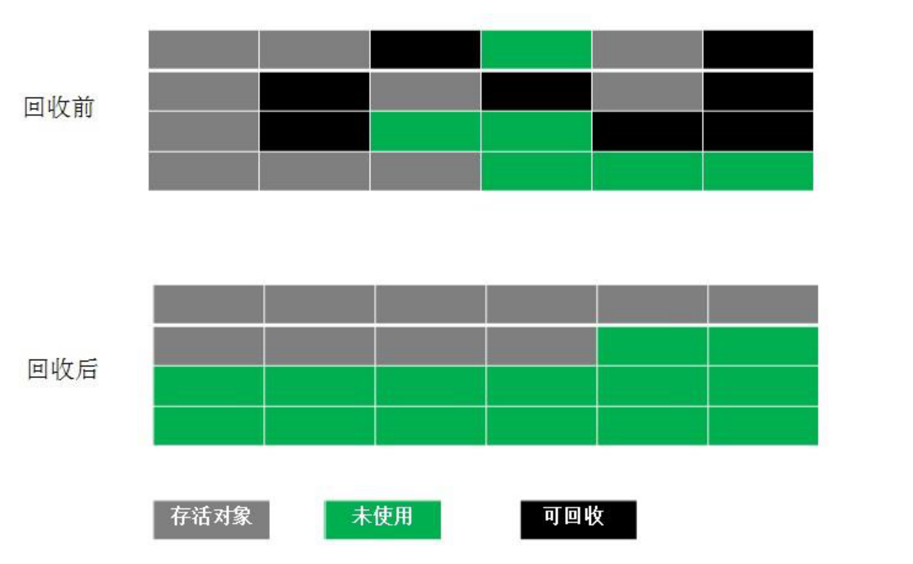

# 一、 Java内存区域

## 常见面试题

- **介绍下 Java 内存区域（运行时数据区）**
- **Java 对象的创建过程（五步，建议能默写出来并且要知道每一步虚拟机做了什么）**
- **对象的访问定位的两种方式（句柄和直接指针两种方式）**
- **String 类和常量池**
- **8 种基本类型的包装类和常量池**

##  1. 运行时数据区域
​		Java 虚拟机在执行 Java 程序的过程中会把它管理的内存划分成若干个不同的数据区域。JDK. 1.8 和之前的版本略有不同。


​	 JVM 内存区域主要分为线程私有区域【程序计数器、虚拟机栈、本地方法区】、线程共享区域【JAVA 堆、方法区】、直接内存。
**线程私有数据区域生命周期与线程相同, 依赖用户线程的 启动/结束 而 创建/销毁 (在 Hotspot VM 内**, 每个线程都与操作系统的本地线程直接映射, 因此这部分内存区域的存/否跟随本地线程的生/死对应)。

### 1.1程序计数器(线程私有)

一块较小的内存空间, 是当前线程所执行的字节码的行号指示器，每条线程都要有一个独立的
程序计数器，这类内存也称为“线程私有”的内存。
正在执行 java 方法的话，计数器记录的是虚拟机字节码指令的地址（当前指令的地址）。如
果还是 Native 方法，则为空。
这个内存区域是唯一一个在虚拟机中没有规定任何 OutOfMemoryError 情况的区域。

### 1.2 虚拟机栈(线程私有)

是描述java方法执行的内存模型，每个方法在执行的同时都会创建一个栈帧（Stack Frame）
用于存储局部变量表、操作数栈、动态链接、方法出口等信息。每一个方法从调用直至执行完成
的过程，就对应着一个栈帧在虚拟机栈中入栈到出栈的过程。

栈帧（ Frame）是用来存储数据和部分过程结果的数据结构，同时也被用来处理动态链接
(Dynamic Linking)、 方法返回值和异常分派（ Dispatch Exception）。栈帧随着方法调用而创
建，随着方法结束而销毁——无论方法是正常完成还是异常完成（抛出了在方法内未被捕获的异
常）都算作方法结束。


### 1.3 本地方法栈(线程私有)

和虚拟机栈所发挥的作用非常相似，区别是： **虚拟机栈为虚拟机执行 Java 方法 （也就是字节码）服务，而本地方法栈则为虚拟机使用到的 Native 方法服务。** 在 HotSpot 虚拟机中和 Java 虚拟机栈合二为一。

本地方法被执行的时候，在本地方法栈也会创建一个栈帧，用于存放该本地方法的局部变量表、操作数栈、动态链接、出口信息。

方法执行完毕后相应的栈帧也会出栈并释放内存空间，也会出现 StackOverFlowError 和 OutOfMemoryError 两种异常。

### 1.4 方法区（线程共享）

方法区与 Java 堆一样，是各个线程共享的内存区域，它用于存储已被虚拟机加载的**类信息、常量、静态变量、即时编译器编译后的代码**等数据。虽然 Java 虚拟机规范把方法区描述为堆的一个逻辑部分，但是它却有一个别名叫做 **Non-Heap（非堆）**，目的应该是与 Java 堆区分开来。

1. **方法区和永久代的关系**

   《Java 虚拟机规范》只是规定了有方法区这么个概念和它的作用，并没有规定如何去实现它。那么，在不同的 JVM 上方法区的实现肯定是不同的了。 **方法区和永久代的关系很像 Java 中接口和类的关系，类实现了接口，而永久代就是 HotSpot 虚拟机对虚拟机规范中方法区的一种实现方式。** 也就是说，永久代是 HotSpot 的概念，方法区是 Java 虚拟机规范中的定义，是一种规范，而永久代是一种实现，一个是标准一个是实现，其他的虚拟机实现并没有永久代这一说法。

   HotSpot 对方法区的实现在不同版本也有所不同:

   - java7之前，方法区位于永久代(PermGen)，永久代和堆相互隔离，永久代的大小在启动JVM时可以设置一个固定值，不可变；
   - java7中，存储在永久代的部分数据就已经转移到Java Heap或者Native memory。但永久代仍存在于JDK 1.7中，并没有完全移除，譬如**符号引用(Symbols)转移到了native memory**；**字符串常量(interned strings)转移到了Java heap**；**类的静态变量(class statics)转移到了Java heap**。
   - java8中，取消永久代，新增元空间(Metaspace)，其实在这两者之间存储的内容几乎没怎么变化，而是在内存限制、垃圾回收等机制上改变较大。元空间的出现就是为了解决突出的**类和类加载器**元数据过多导致的OOM问题，而从jdk7中开始永久代经过对方法区的分裂后已经几乎只存储**类和类加载器的元数据信息**了，到了jdk8，元空间中也是存储这些信息，而符号引用、字符串常量等存储位置与jdk7一致，还是“分裂”的方法区。
     Native memory：本地内存，也称为C-Heap，是供JVM自身进程使用的。当Java Heap空间不足时会触发GC，但Native memory空间不够却不会触发GC。

2. **常用参数**

   JDK 1.8 之前永久代还没被彻底移除的时候通常通过下面这些参数来调节方法区大小

   ```java
   -XX:PermSize=N //方法区 (永久代) 初始大小
   -XX:MaxPermSize=N //方法区 (永久代) 最大大小,超过这个值将会抛出 OutOfMemoryError 异常:java.lang.OutOfMemoryError: PermGen
   ```

   相对而言，垃圾收集行为在这个区域是比较少出现的，但并非数据进入方法区后就“永久存在”了。

   JDK 1.8 的时候，方法区（HotSpot 的永久代）被彻底移除了（JDK1.7 就已经开始了），取而代之是元空间，元空间使用的是直接内存。

   下面是一些常用参数：

   ```java
   -XX:MetaspaceSize=N //设置 Metaspace 的初始（和最小大小）
   -XX:MaxMetaspaceSize=N //设置 Metaspace 的最大大小
   ```

   与永久代很大的不同就是，如果不指定大小的话，随着更多类的创建，虚拟机会耗尽所有可用的系统内存。

3. #### 为什么要将永久代 (PermGen) 替换为元空间 (MetaSpace) 呢?

   整个永久代有一个 JVM 本身设置固定大小上限，无法进行调整，而元空间使用的是直接内存，受本机可用内存的限制，并且永远不会得到 java.lang.OutOfMemoryError。你可以使用 `-XX：MaxMetaspaceSize` 标志设置最大元空间大小，默认值为 unlimited，这意味着它只受系统内存的限制。`-XX：MetaspaceSize` 调整标志定义元空间的初始大小如果未指定此标志，则 Metaspace 将根据运行时的应用程序需求动态地重新调整大小。

   当然这只是其中一个原因，还有很多底层的原因，这里就不提了。

### 1.5 堆(线程共享)

Java 虚拟机所管理的内存中最大的一块，Java 堆是所有线程共享的一块内存区域，在虚拟机启动时创建。**此内存区域的唯一目的就是存放对象实例，几乎所有的对象实例以及数组都在这里分配内存。**

Java 堆是垃圾收集器管理的主要区域，因此也被称作**GC 堆（Garbage Collected Heap）**.从垃圾回收的角度，由于现在收集器基本都采用分代垃圾收集算法，所以 Java 堆还可以细分为：新生代和老年代：再细致一点有：Eden 空间、From Survivor、To Survivor 空间等。**进一步划分的目的是更好地回收内存，或者更快地分配内存。**



1. 新生代

   是用来存放新生的对象。一般占据堆的 1/3 空间。由于频繁创建对象，所以新生代会频繁触发
   MinorGC 进行垃圾回收。新生代又分为 Eden 区、ServivorFrom、ServivorTo 三个区。

   1. Eden 区

      Java 新对象的出生地（**如果新创建的对象占用内存很大，则直接分配到老年代**）。当 **Eden 区内存不够的时候就会触发 MinorGC**，对新生代区进行一次垃圾回收。

   2. ServivorFrom

      上一次 GC 的幸存者，作为这一次 GC 的被扫描者。

   3. ServivorTo

      保留了一次 MinorGC 过程中的幸存者。

   4. MinorGC 的过程（复制->清空->互换）

      MinorGC 采用**复制算法**。

      1. eden、servicorFrom 复制到 ServicorTo，年龄+1

         首先，把 Eden 和 ServivorFrom 区域中存活的对象复制到 ServicorTo 区域（如果有对象的年
         龄以及达到了老年的标准(默认为 15 岁)，则赋值到老年代区），同时把这些对象的年龄+1（如果 ServicorTo 不够位置了就放到老年区）;

      2. 清空 eden、servicorFrom

         然后，清空 Eden 和 ServicorFrom 中的对象;

      3. ServicorTo 和 ServicorFrom 互换

         最后，ServicorTo 和 ServicorFrom 互换，原 ServicorTo 成为下一次 GC 时的 ServicorFrom
         区。

2. 老年代

   主要存放应用程序中生命周期长的内存对象。
   老年代的对象比较稳定，所以 MajorGC 不会频繁执行。**在进行 MajorGC 前一般都先进行了一次 MinorGC，使得有新生代的对象晋身入老年代，导致空间不够用时才触发**。当无法找到足
   够大的连续空间分配给新创建的较大对象时也会提前触发一次 MajorGC 进行垃圾回收腾出空间。
   MajorGC 采用**标记清除算法**：首先扫描一次所有老年代，标记出存活的对象，然后回收没
   有标记的对象。MajorGC 的耗时比较长，因为要扫描再回收。MajorGC 会产生内存碎片，为了减
   少内存损耗，我们一般需要进行合并或者标记出来方便下次直接分配。当老年代也满了装不下的
   时候，就会抛出 OOM（Out of Memory）异常。

### 1.6 运行时常量池(线程共享)

运行时常量池是方法区的一部分。Class 文件中除了有类的版本、字段、方法、接口等描述信息外，还有常量池信息（用于存放编译期生成的各种字面量和符号引用）

既然运行时常量池是方法区的一部分，自然受到方法区内存的限制，当常量池无法再申请到内存时会抛出 OutOfMemoryError 异常。

**JDK1.7 后,移除了方法区,运行时常量池和字符串常量池都被放在堆中。**

### 1.7 直接内存

**直接内存并不是虚拟机运行时数据区的一部分，也不是虚拟机规范中定义的内存区域，但是这部分内存也被频繁地使用。而且也可能导致 OutOfMemoryError 异常出现。**

JDK1.4 中新加入的 **NIO(New Input/Output) 类**，引入了一种基于**通道（Channel）** 与**缓存区（Buffer）** 的 I/O 方式，它可以直接使用 Native 函数库直接分配堆外内存，然后通过一个存储在 Java 堆中的 DirectByteBuffer 对象作为这块内存的引用进行操作。这样就能在一些场景中显著提高性能，因为**避免了在 Java 堆和 Native 堆之间来回复制数据**。

本机直接内存的分配不会受到 Java 堆的限制，但是，既然是内存就会受到本机总内存大小以及处理器寻址空间的限制。

# 二、 JVM垃圾回收机制

## 常见面试题

- 如何判断对象是否死亡（两种方法）。

- 简单的介绍一下强引用、软引用、弱引用、虚引用（虚引用与软引用和弱引用的区别、使用软引用能带来的好处）。

- 如何判断一个常量是废弃常量

- 如何判断一个类是无用的类

- 垃圾收集有哪些算法，各自的特点？

- HotSpot 为什么要分为新生代和老年代？

- 常见的垃圾回收器有那些？

- 介绍一下 CMS,G1 收集器。

- Minor Gc 和Full GC 有什么不同呢？

## 1 概览

   

java内存是自动管理的，但当需要排查各种内存溢出问题、垃圾收集成为系统达到更高并发的瓶颈时，我们就需要对这些“自动化”的技术实施必要的监控和调节。

需要了解 内存是如何分配和回收的？哪些垃圾需要回收？什么时候回收？怎么回收？

## 2. 内存是如何分配和回收的？

​	Java 的自动内存管理主要是针对对象内存的回收和对象内存的分配。同时，Java 自动内存管理最核心的功能是 **堆** 内存中对象的分配与回收。

​	Java 堆是垃圾收集器管理的主要区域，因此也被称作**GC 堆（Garbage Collected Heap）**.从垃圾回收的角度，由于现在收集器基本都采用分代垃圾收集算法，所以 Java 堆还可以细分为：新生代和老年代：再细致一点有：Eden 空间、From Survivor、To Survivor 空间等。**进一步划分的目的是更好地回收内存，或者更快地分配内存。**

堆的基本内存结构：


​	大部分情况，对象都会首先在 Eden 区域分配，在一次新生代垃圾回收后，如果对象还存活，则会进入 s1("To")，并且对象的年龄还会加 1(Eden 区->Survivor 区后对象的初始年龄变为 1)，当它的年龄增加到一定程度（默认为 15 岁），就会被晋升到老年代中。对象晋升到老年代的年龄阈值，可以通过参数 `-XX:MaxTenuringThreshold` 来设置。经过这次GC后，Eden区和"From"区已经被清空。这个时候，"From"和"To"会交换他们的角色，也就是新的"To"就是上次GC前的“From”，新的"From"就是上次GC前的"To"。不管怎样，都会保证名为To的Survivor区域是空的。Minor GC会一直重复这样的过程，直到“To”区被填满，"To"区被填满之后，会将所有对象移动到年老代中。


### 2.1对象优先在eden区分配

​	目前主流的垃圾收集器都会采用分代回收算法，因此需要将堆内存分为新生代和老年代，这样我们就可以根据各个年代的特点选择合适的垃圾收集算法。

​	大多数情况下，对象在新生代中 eden 区分配。当 eden 区没有足够空间进行分配时，虚拟机将发起一次 Minor GC.

### 2.2 大对象直接进入老年代

​	大对象就是需要大量连续内存空间的对象（比如：字符串、数组）。

  **为什么要这样呢？**

​	为了避免为大对象分配内存时由于分配担保机制带来的复制而降低效率。

### 2.3 长期存活的对象进入老年代

​	既然虚拟机采用了分代收集的思想来管理内存，那么内存回收时就必须能识别哪些对象应放在新生代，哪些对象应放在老年代中。为了做到这一点，虚拟机给每个对象一个对象年龄（Age）计数器。

​	如果对象在 Eden 出生并经过第一次 Minor GC 后仍然能够存活，并且能被 Survivor 容纳的话，将被移动到 Survivor 空间中，并将对象年龄设为 1.对象在 Survivor 中每熬过一次 MinorGC,年龄就增加 1 岁，当它的年龄增加到一定程度（默认为 15 岁），就会被晋升到老年代中。对象晋升到老年代的年龄阈值，可以通过参数 `-XX:MaxTenuringThreshold` 来设置。

​	为了更好的适应不同程序的内存情况，虚拟机不是永远要求对象年龄必须达到了某个值才能进入老年代，**如果 Survivor 空间中相同年龄所有对象大小的总和大于 Survivor 空间的一半，年龄大于或等于该年龄的对象就可以直接进入老年代，无需达到要求的年龄**。

## 3. 如何确定哪些垃圾需要回收?

堆中几乎放着所有的对象实例，对堆垃圾回收前的第一步就是要判断那些对象已经死亡（即不能再被任何途径使用的对象）。



### 3.1 引用计数法

在 Java 中，引用和对象是有关联的。如果要操作对象则必须用引用进行。因此，很显然一个简单的办法是通过引用计数来判断一个对象是否可以回收。简单说，即**一个对象如果没有任何与之关联的引用，即他们的引用计数都不为 0，则说明对象不太可能再被用到，那么这个对象就是可回收对象。**

**这个方法实现简单，效率高，但是目前主流的虚拟机中并没有选择这个算法来管理内存，其最主要的原因是它很难解决对象之间相互循环引用的问题。** 所谓对象之间的相互引用问题，如下面代码所示：除了对象 objA 和 objB 相互引用着对方之外，这两个对象之间再无任何引用。但是他们因为互相引用对方，导致它们的引用计数器都不为 0，于是引用计数算法无法通知 GC 回收器回收他们。

```java
public class ReferenceCountingGc {
    Object instance = null;
    public static void main(String[] args) {
        ReferenceCountingGc objA = new ReferenceCountingGc();
        ReferenceCountingGc objB = new ReferenceCountingGc();
        objA.instance = objB;
        objB.instance = objA;
        objA = null;
        objB = null;

    }
}
```


### 3.2 可达性分析(根搜索算法)

为了解决引用计数法的循环引用问题，Java 使用了可达性分析的方法。通过一系列的“GC roots”
对象作为起点搜索。如果在“GC roots”和一个对象之间没有可达路径，则称该对象是不可达的。
要注意的是，不可达对象不等价于可回收对象，不可达对象变为可回收对象至少要经过两次标记
过程。两次标记后仍然是可回收对象，则将面临回收。


### 3.3 关于引用

无论是通过引用计数法判断对象引用数量，还是通过可达性分析法判断对象的引用链是否可达，判定对象的存活都与“引用”有关。
JDK1.2 之前，Java 中引用的定义很传统：如果 reference 类型的数据存储的数值代表的是另一块内存的起始地址，就称这块内存代表一个引用。
JDK1.2 以后，Java 对引用的概念进行了扩充，将引用分为强引用、软引用、弱引用、虚引用四种（引用强度逐渐减弱）

#### 3.3.1 强引用

以前我们使用的大部分引用实际上都是强引用，这是使用最普遍的引用。如果一个对象具有强引用，那就类似于**必不可少的生活用品**，垃圾回收器绝不会回收它。当内存空间不足，Java 虚拟机宁愿抛出 OutOfMemoryError 错误，使程序异常终止，也不会靠随意回收具有强引用的对象来解决内存不足问题。

#### 3.3.2 软引用

如果一个对象只具有软引用，那就类似于**可有可无的生活用品**。如果内存空间足够，垃圾回收器就不会回收它，如果内存空间不足了，就会回收这些对象的内存。只要**垃圾回收器没有回收它，该对象就可以被程序使用**。**软引用可用来实现内存敏感的高速缓存**。

软引用可以和一个引用队列（ReferenceQueue）联合使用，如果软引用所引用的对象被垃圾回收，JAVA 虚拟机就会把这个软引用加入到与之关联的引用队列中。

#### 3.3.3 弱引用

如果一个对象只具有弱引用，那就类似于**可有可无的生活用品**。**弱引用与软引用的区别**在于：**只具有弱引用的对象拥有更短暂的生命周期**。在垃圾回收器线程扫描它所管辖的内存区域的过程中，一旦发现了只具有弱引用的对象，不管当前内存空间足够与否，都会回收它的内存。不过，由于垃圾回收器是一个优先级很低的线程， 因此不一定会很快发现那些只具有弱引用的对象。

弱引用可以和一个引用队列（ReferenceQueue）联合使用，如果弱引用所引用的对象被垃圾回收，Java 虚拟机就会把这个弱引用加入到与之关联的引用队列中。

#### 3.3.4 虚引用

"虚引用"顾名思义，就是形同虚设，与其他几种引用都不同，虚引用并不会决定对象的生命周期。如果一个对象仅持有虚引用，那么它就和没有任何引用一样，在任何时候都可能被垃圾回收。

**虚引用主要用来跟踪对象被垃圾回收的活动**。

**虚引用与软引用和弱引用的一个区别在于：** 虚引用必须和引用队列（ReferenceQueue）联合使用。当垃圾回收器准备回收一个对象时，如果发现它还有虚引用，就会在回收对象的内存之前，把这个虚引用加入到与之关联的引用队列中。程序可以通过判断引用队列中是否已经加入了虚引用，来了解被引用的对象是否将要被垃圾回收。程序如果发现某个虚引用已经被加入到引用队列，那么就可以在所引用的对象的内存被回收之前采取必要的行动。

特别注意，在程序设计中一般很少使用弱引用与虚引用，使用软引用的情况较多，这是因为**软引用可以加速 JVM 对垃圾内存的回收速度，可以维护系统的运行安全，防止内存溢出（OutOfMemory）等问题的产生**。

### 3.4 不可达对象并非"非死不可"

即使在可达性分析法中不可达的对象，也并非是“非死不可”的，这时候它们暂时处于“缓刑阶段”，要真正宣告一个对象死亡，至少要经历两次标记过程；可达性分析法中不可达的对象被第一次标记并且进行一次筛选，筛选的条件是此对象是否有必要执行 finalize 方法。当对象没有覆盖 finalize 方法，或 finalize 方法已经被虚拟机调用过时，虚拟机将这两种情况视为没有必要执行。

被判定为需要执行的对象将会被放在一个队列中进行第二次标记，除非这个对象与引用链上的任何一个对象建立关联，否则就会被真的回收。

### 3.5 如何判断一个常量是废弃常量

运行时常量池主要回收的是废弃的常量。那么，我们如何判断一个常量是废弃常量呢？

假如在常量池中存在字符串 "abc"，如果当前没有任何 String 对象引用该字符串常量的话，就说明常量 "abc" 就是废弃常量，如果这时发生内存回收的话而且有必要的话，"abc" 就会被系统清理出常量池。

### 3.6 如何判断一个类是无用的类

方法区主要回收的是无用的类，那么如何判断一个类是无用的类的呢？

判定一个常量是否是“废弃常量”比较简单，而要判定一个类是否是“无用的类”的条件则相对苛刻许多。类需要同时满足下面 3 个条件才能算是 **“无用的类”** ：

- 该类所有的实例都已经被回收，也就是 Java 堆中不存在该类的任何实例。
- 加载该类的 ClassLoader 已经被回收。
- 该类对应的 java.lang.Class 对象没有在任何地方被引用，无法在任何地方通过反射访问该类的方法。

虚拟机可以对满足上述 3 个条件的无用类进行回收，这里说的仅仅是“可以”，而并不是和对象一样不使用了就会必然被回收。

## 4. 有哪些垃圾回收算法?

### 4.1 标记清除算法（Mark-Sweep）

最基础的垃圾回收算法，分为两个阶段，标注和清除。标记阶段标记出所有需要回收的对象，清
除阶段回收被标记的对象所占用的空间。如图:


从图中我们就可以发现，该算法最大的问题是内存碎片化严重，后续可能发生大对象不能找到可
利用空间的问题。

### 4.2 复制算法（copying）

为了解决 Mark-Sweep 算法内存碎片化的缺陷而被提出的算法。按内存容量将内存划分为等大小
的两块。每次只使用其中一块，当这一块内存满后将尚存活的对象复制到另一块上去，把已使用
的内存清掉，如图：


这种算法虽然实现简单，内存效率高，不易产生碎片，但是最大的问题是可用内存被压缩到了原
本的一半。且存活对象增多的话，Copying 算法的效率会大大降低。

### 4.3 标记整理算法(Mark-Compact)

结合了以上两个算法，为了避免缺陷而提出。标记阶段和 Mark-Sweep 算法相同，标记后不是清
理对象，而是将存活对象移向内存的一端。然后清除端边界外的对象。如图：



### 4.4 分代收集算法

当前虚拟机的垃圾收集都采用分代收集算法，这种算法没有什么新的思想，只是根据对象存活周期的不同将内存分为几块。一般将 java 堆分为新生代和老年代，这样我们就可以根据各个年代的特点选择合适的垃圾收集算法。

**比如在新生代中，每次收集都会有大量对象死去，所以可以选择复制算法，只需要付出少量对象的复制成本就可以完成每次垃圾收集。而老年代的对象存活几率是比较高的，而且没有额外的空间对它进行分配担保，所以我们必须选择“标记-清除”或“标记-整理”算法进行垃圾收集。**

## 5. 有哪些GC垃圾收集器?

​	Java 堆内存被划分为新生代和年老代两部分，新生代主要使用复制和标记-清除垃圾回收算法；老代主要使用标记-整理垃圾回收算法，因此 java 虚拟中针对新生代和年老代分别提供了多种不同的垃圾收集器，JDK1.6 中 Sun HotSpot 虚拟机的垃圾收集器如下:


### 5.1 Serial 垃圾收集器（单线程、复制算法）

Serial（串行）收集器收集器是最基本、历史最悠久的垃圾收集器了。大家看名字就知道这个收集器是一个单线程收集器了。它的 **“单线程”** 的意义不仅仅意味着它只会使用一条垃圾收集线程去完成垃圾收集工作，更重要的是它在进行垃圾收集工作的时候必须暂停其他所有的工作线程（ **"Stop The World"** ），直到它收集结束。


Serial 垃圾收集器虽然在收集垃圾过程中需要暂停所有其他的工作线程，但是它简单高效，对于限
定单个 CPU 环境来说，没有线程交互的开销，可以获得最高的单线程垃圾收集效率，因此 Serial
垃圾收集器依然是 java 虚拟机运行在 Client 模式下默认的新生代垃圾收集器。

### 5.2 ParNew 垃圾收集器（Serial+多线程）

**ParNew 收集器其实就是 Serial 收集器的多线程版本，除了使用多线程进行垃圾收集外，其余行为（控制参数、收集算法、回收策略等等）和 Serial 收集器完全一样。**


ParNew 收集器默认开启和 CPU 数目相同的线程数，可以通过-XX:ParallelGCThreads 参数来限
制垃圾收集器的线程数。【Parallel：平行的】
ParNew虽然是除了多线程外和Serial 收集器几乎完全一样，但是ParNew垃圾收集器是很多 java
虚拟机运行在 Server 模式下新生代的默认垃圾收集器.

**并行和并发概念补充：**

- **并行（Parallel）** ：指多条垃圾收集线程并行工作，但此时用户线程仍然处于等待状态。
- **并发（Concurrent）**：指用户线程与垃圾收集线程同时执行（但不一定是并行，可能会交替执行），用户程序在继续运行，而垃圾收集器运行在另一个 CPU 上。

### 5.3 Parallel Scavenge 收集器（多线程复制算法、高效）

Parallel Scavenge 收集器也是使用复制算法的多线程收集器，它看上去几乎和ParNew都一样。 **那么它有什么特别之处呢？**

```java
-XX:+UseParallelGC 

    使用 Parallel 收集器+ 老年代串行

-XX:+UseParallelOldGC

    使用 Parallel 收集器+ 老年代并行
```

**Parallel Scavenge 收集器关注点是吞吐量（高效率的利用 CPU）。CMS 等垃圾收集器的关注点更多的是用户线程的停顿时间（提高用户体验）。所谓吞吐量就是 CPU 中用于运行用户代码的时间与 CPU 总消耗时间的比值。** Parallel Scavenge 收集器提供了很多参数供用户找到最合适的停顿时间或最大吞吐量，如果对于收集器运作不太了解的话，手工优化存在困难的话可以选择把内存管理优化交给虚拟机去完成也是一个不错的选择。


### 5.4 Serial Old 收集器（单线程标记整理算法 ）

**Serial 收集器的老年代版本**，它同样是一个单线程收集器。它主要有两大用途：一种用途是在 JDK1.5 以及以前的版本中与 Parallel Scavenge 收集器搭配使用，另一种用途是作为 CMS 收集器的后备方案。

新生代 Serial 与年老代 Serial Old 搭配垃圾收集过程图：


Scavenge/ParNew 与年老代 Serial Old 搭配垃圾收集过程图：


### 5.5 Parallel Old 收集器（多线程标记整理算法）

**Parallel Scavenge 收集器的老年代版本**。使用多线程和“标记-整理”算法。在注重吞吐量以及 CPU 资源的场合，都可以优先考虑 Parallel Scavenge 收集器和 Parallel Old 收集器。

新生代 Parallel Scavenge 和年老代 Parallel Old 收集器搭配运行过程图：


### 5.6 CMS 收集器（多线程标记清除算法）

**CMS（Concurrent Mark Sweep）收集器是一种以获取最短回收停顿时间为目标的收集器。它非常符合在注重用户体验的应用上使用。**

**CMS（Concurrent Mark Sweep）收集器是 HotSpot 虚拟机第一款真正意义上的并发收集器，它第一次实现了让垃圾收集线程与用户线程（基本上）同时工作。**

从名字中的**Mark Sweep**这两个词可以看出，CMS 收集器是一种 **“标记-清除”算法**实现的，它的运作过程相比于前面几种垃圾收集器来说更加复杂一些。整个过程分为四个步骤：

1. **初始标记：** 暂停所有的其他线程，并记录下直接与 root 相连的对象，速度很快 ；

2. **并发标记：** 同时开启 GC 和用户线程，用一个闭包结构去记录可达对象。但在这个阶段结束，这个闭包结构并不能保证包含当前所有的可达对象。因为用户线程可能会不断的更新引用域，所以 GC 线程无法保证可达性分析的实时性。所以这个算法里会跟踪记录这些发生引用更新的地方。

3. **重新标记：** 重新标记阶段就是为了修正并发标记期间因为用户程序继续运行而导致标记产生变动的那一部分对象的标记记录，这个阶段的停顿时间一般会比初始标记阶段的时间稍长，远远比并发标记阶段时间短

4. **并发清除：** 开启用户线程，同时 GC 线程开始对为标记的区域做清扫。

   CMS 收集器工作过程：

   

   CMS是一款优秀的垃圾收集器,主要优点：**并发收集、低停顿**。但是它有下面三个明显的缺点：

   - **对 CPU 资源敏感；**
   - **无法处理浮动垃圾；**
   - **它使用的回收算法-“标记-清除”算法会导致收集结束时会有大量空间碎片产生。**

### 5.7 G1 收集器

**G1 (Garbage-First) 是一款面向服务器的垃圾收集器,主要针对配备多颗处理器及大容量内存的机器. 以极高概率满足 GC 停顿时间要求的同时,还具备高吞吐量性能特征.**

相比与 CMS 收集器，G1 收集器两个最突出的改进是:

1. 基于**标记-整理算法，不产生内存碎片**。

2. 可以非常**精确控制停顿时间**，在不牺牲吞吐量前提下，实现低停顿垃圾回收。

G1 收集器避免全区域垃圾收集，它把堆内存划分为大小固定的几个独立区域(**Region**)，并且跟踪这些区域的垃圾收集进度，同时在后台维护一个优先级列表，每次根据所允许的收集时间，优先回收垃圾
最多的区域。区域划分和优先级区域回收机制，确保 G1 收集器可以在有限时间获得最高的垃圾收集效率。

G1收集器具有以下特点:

1. **并行与并发**：G1 能充分利用 CPU、多核环境下的硬件优势，使用多个 CPU（CPU 或者 CPU 核心）来缩短 Stop-The-World 停顿时间。部分其他收集器原本需要停顿 Java 线程执行的 GC 动作，G1 收集器仍然可以通过并发的方式让 java 程序继续执行。
2. **分代收集**：虽然 G1 可以不需要其他收集器配合就能独立管理整个 GC 堆，但是还是保留了分代的概念。
3. **空间整合**：与 CMS 的“标记--清理”算法不同，G1 从整体来看是基于“标记整理”算法实现的收集器；从局部上来看是基于“复制”算法实现的。
4. **可预测的停顿**：这是 G1 相对于 CMS 的另一个大优势，降低停顿时间是 G1 和 CMS 共同的关注点，但 G1 除了追求低停顿外，还能建立可预测的停顿时间模型，能让使用者明确指定在一个长度为 M 毫秒的时间片段内。

G1 收集器的运作大致分为以下几个步骤：

1. **初始标记**
2. **并发标记**
3. **最终标记**
4. **筛选回收**


## 6. GC 触发条件及优化

### 6.1 Minor GC ,Major GC, Full GC 有什么不同？

针对HotSpot VM的实现，它里面的GC其实准确分类只有两大种：

- **Partial GC**：并不收集整个GC堆的模式
  - Young GC：只收集young gen的GC
  - Old GC：只收集old gen的GC。只有CMS的concurrent collection是这个模式
  - Mixed GC：收集整个young gen以及部分old gen的GC。只有G1有这个模式
- **Full GC**：收集整个堆，包括young gen、old gen、perm gen（如果存在的话）等所有部分的模式。

Major GC通常是跟full GC是等价的，收集整个GC堆。但因为HotSpot VM发展了这么多年，外界对各种名词的解读已经完全混乱了，当有人说“major GC”的时候一定要问清楚他想要指的是上面的full GC还是old gen。

最简单的分代式GC策略，按HotSpot VM的serial GC的实现来看，触发条件是：

- **young GC**：当young gen中的eden区分配满的时候触发。注意young GC中有部分存活对象会晋升到old gen，所以young GC后old gen的占用量通常会有所升高。
- **full GC**：当准备要触发一次young GC时，如果发现统计数据说之前young GC的平均晋升大小比目前old gen剩余的空间大，则不会触发young GC而是转为触发full GC（因为HotSpot VM的GC里，除了CMS的concurrent collection之外，其它能收集old gen的GC都会同时收集整个GC堆，包括young gen，所以不需要事先触发一次单独的young GC）；或者，如果有perm gen的话，要在perm gen分配空间但已经没有足够空间时，也要触发一次full GC；或者System.gc()、heap dump带GC，默认也是触发full GC。

HotSpot VM里其它非并发GC的触发条件复杂一些，不过大致的原理与上面说的其实一样。当然也总有例外。Parallel Scavenge（-XX:+UseParallelGC）框架下，默认是在要触发full GC前先执行一次young GC，并且两次GC之间能让应用程序稍微运行一小下，以期降低full GC的暂停时间（因为young GC会尽量清理了young gen的死对象，减少了full GC的工作量）。这是HotSpot VM里的奇葩.

并发GC的触发条件就不太一样。以CMS GC为例，它主要是定时去检查old gen的使用量，当使用量超过了触发比例就会启动一次CMS GC，对old gen做并发收集。

当然也可以简单的回答:

- **Minor GC**:指发生新生代的的垃圾收集动作，Minor GC 非常频繁，回收速度一般也比较快。
- **Full GC**: 指收集整个堆，出现了 Full GC 经常会伴随至少一次的 Minor GC（并非绝对），Full GC 的速度一般会比 Minor GC 的慢 10 倍以上。

### 6.2 Full GC 触发条件及优化

1. System.gc()方法的调用

   此方法的调用是**建议JVM进行Full GC**,虽然只是建议而非一定,但很多情况下它会触发 Full GC,从而增加Full GC的频率,也即增加了间歇性停顿的次数。强烈影响系建议能不使用此方法就别使用，让虚拟机自己去管理它的内存，可通过**设置```-XX:+ DisableExplicitGC```来禁止RMI调用System.gc**。

2. 老年代代空间不足

   老年代空间只有在新生代对象转入及创建为大对象、大数组时才会出现不足的现象，当执行Full GC后空间仍然不足，则抛出如下错误：```java.lang.OutOfMemoryError: Java heap space```

   为避免以上两种状况引起的Full GC，调优时应**尽量做到让对象在Minor GC阶段被回收**、让**对象在新生代多存活一段时间**及**不要创建过大的对象及数组**。

3. 方法区空间不足(jdk1.8 去掉了方法区)

   JVM规范中运行时数据区域中的方法区，在HotSpot虚拟机中又被习惯称为永生代或者永生区，Permanet Generation中存放的为一些class的信息、常量、静态变量等数据，当系统中要加载的类、反射的类和调用的方法较多时，Permanet Generation可能会被占满，在未配置为采用CMS GC的情况下也会执行Full GC。如果经过Full GC仍然回收不了，那么JVM会抛出如下错误信息：

   ```java.lang.OutOfMemoryError: PermGen space```

   为避免Perm Gen占满造成Full GC现象，可采用的方法**为增大Perm Gen空间或转为使用CMS GC**。

4. java虚拟机担保机制

   由Eden区、survivor space1（From Space）区向survivor space2（To Space）区复制时，对象大小大于To Space可用内存，则把该对象转存到老年代，如果此时老年代空间也无法存储，就会担保失败，担保失败后JVM会进行Major GC

5. 统计得到的Minor GC晋升到旧生代的平均大小大于老年代的剩余空间

   这是一个较为复杂的触发情况，Hotspot为了避免由于新生代对象晋升到旧生代导致旧生代空间不足的现象，在进行Minor GC时，做了一个判断，如果之前统计所得到的Minor GC晋升到旧生代的平均大小大于旧生代的剩余空间，那么就直接触发Full GC。

   例如程序第一次触发Minor GC后，有6MB的对象晋升到旧生代，那么当下一次Minor GC发生时，首先检查旧生代的剩余空间是否大于6MB，如果小于6MB，

   则执行Full GC。

   当新生代采用PS GC时，方式稍有不同，PS GC是在Minor GC后也会检查，例如上面的例子中第一次Minor GC后，PS GC会检查此时旧生代的剩余空间是否

   大于6MB，如小于，则触发对旧生代的回收。

6. 堆中分配很大的对象

   所谓大对象，是指需要大量连续内存空间的java对象，例如很长的数组，此种对象会直接进入老年代，而老年代虽然有很大的剩余空间，但是无法找到足够大的连续空间来分配给当前对象，此种情况就会触发JVM进行Full GC。

   为了解决这个问题，CMS垃圾收集器提供了一个可配置的参数，即```-XX:+UseCMSCompactAtFullCollection``开关参数，用于在“享受”完Full GC服务之后额外免费赠送一个碎片整理的过程，内存整理的过程无法并发的，空间碎片问题没有了，但提顿时间不得不变长了，JVM设计者们还提供了另外一个参数 

   ```-XX:CMSFullGCsBeforeCompaction```,这个参数用于设置在执行多少次不压缩的Full GC后,跟着来一次带压缩的。

# 参考

- 《深入理解 Java 虚拟机：JVM 高级特性与最佳实践（第二版》
- https://my.oschina.net/hosee/blog/644618
- https://docs.oracle.com/javase/specs/jvms/se8/html/index.html


