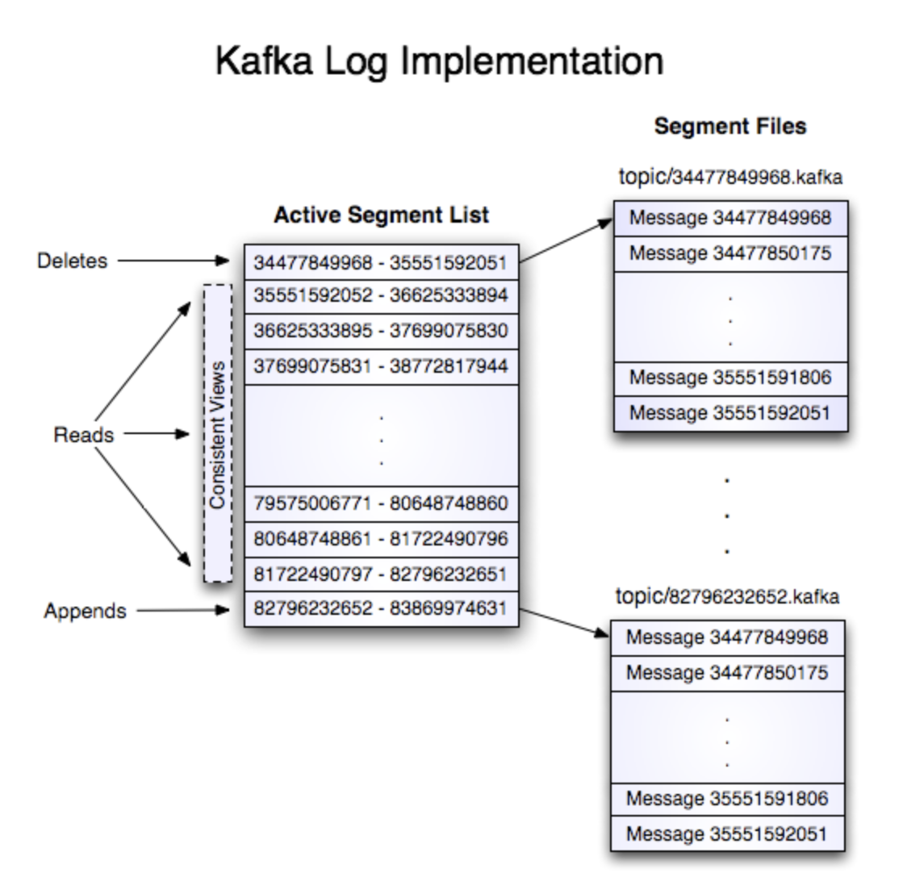
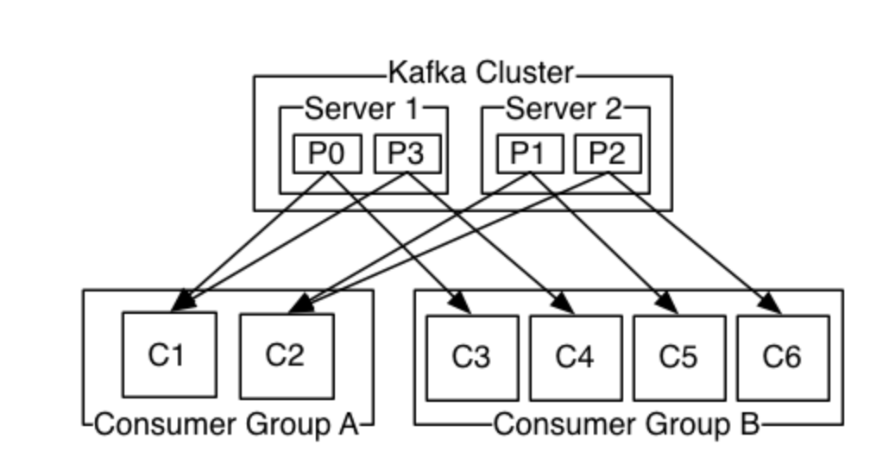
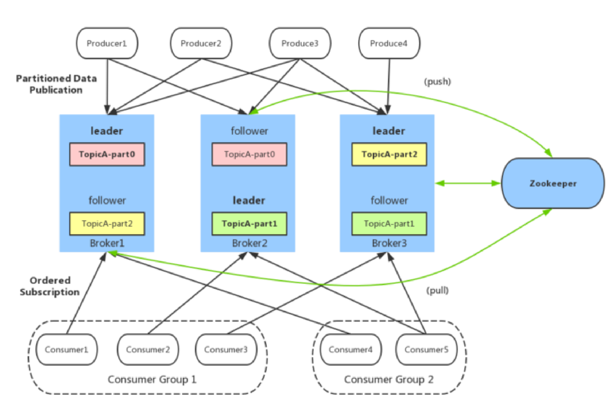
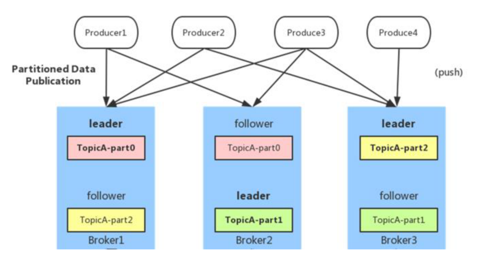
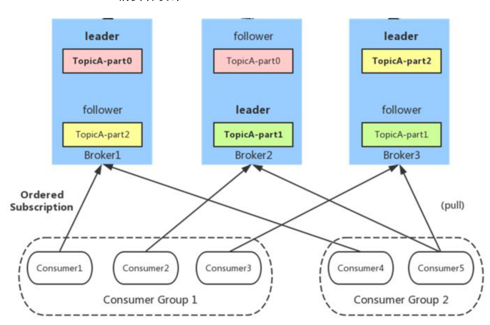

# 1. Kafka 概述

  Kafka 是一种高吞吐量、分布式、基于发布/订阅的消息系统，最初由 LinkedIn 公司开发，使用Scala 语言编写，目前是 Apache 的开源项目。
  主要应用场景是：日志收集系统和消息系统。
  Kafka主要设计目标如下：

- 以时间复杂度为O(1)的方式提供消息持久化能力，即使对TB级以上数据也能保证常数时间的访问性能。
- 高吞吐率。即使在非常廉价的商用机器上也能做到单机支持每秒100K条消息的传输。
- 支持Kafka Server间的消息分区，及分布式消费，同时保证每个partition内的消息顺序传输。
- 同时支持离线数据处理和实时数据处理。
- 支持在线水平扩展

# 2. Kafka中的术语解释

  在深入理解Kafka之前，先介绍一下Kafka中的术语。下图展示了Kafka的相关术语以及之间的关系：

  

上图中一个topic配置了3个partition。Partition1有两个offset：0和1。Partition2有4个offset。Partition3有1个offset。副本的id和副本所在的机器的id恰好相同。
如果一个topic的副本数为3，那么Kafka将在集群中为每个partition创建3个相同的副本。集群中的每个broker存储一个或多个partition。多个producer和consumer可同时生产和消费数据。

1. **broker**：
  Kafka 集群包含一个或多个服务器，服务器节点称为broker，负责消息存储和转发
  broker存储topic的数据。如果某topic有N个partition，集群有N个broker，那么每个broker存储该topic的一个partition。
  如果某topic有N个partition，集群有(N+M)个broker，那么其中有N个broker存储该topic的一个partition，剩下的M个broker不存储该topic的partition数据。
  如果某topic有N个partition，集群中broker数目少于N个，那么一个broker存储该topic的一个或多个partition。在实际生产环境中，尽量避免这种情况的发生，这种情况容易导致Kafka集群数据不均衡。

2. **topic**：
  每条发布到Kafka集群的消息都有一个类别，这个类别被称为Topic。（物理上不同Topic的消息分开存储，逻辑上一个Topic的消息虽然保存于一个或多个broker上但用户只需指定消息的Topic即可生产或消费数据而不必关心数据存于何处）
  类似于数据库的表名
  
3. **partition**：
  topic中的数据分割为一个或多个partition。每个topic至少有一个partition。每个Partition在物理上对应一个文件夹，该文件夹下存储这个Partition的所有消息和索引文件。每个partition中的数据使用多个segment文件存储。partition中的数据是有序的，不同partition间的数据丢失了数据的顺序。如果topic有多个partition，消费数据时就不能保证数据的顺序。在需要严格保证消息的消费顺序的场景下，需要将partition数目设为1。

  
  
4. **offset**：

   kafka的存储文件都是按照offset.kafka来命名，用offset做名字的好处是方便查找。例如你想找位于2049的位置，只要找到2048.kafka的文件即可。当然the first offset就是00000000000.kafka

5. **Producer**：
  生产者即数据的发布者，该角色将消息发布到Kafka的topic中。broker接收到生产者发送的消息后，broker将该消息**追加**到当前用于追加数据的segment文件中。生产者发送的消息，存储到一个partition中，生产者也可以指定数据存储的partition。

6. **Consumer**：

   消费者可以从broker中读取数据。消费者可以消费多个topic中的数据。

7. **Consumer Group**：

   每个Consumer属于一个特定的Consumer Group（可为每个Consumer指定group name，若不指定group name则属于默认的group）。这是kafka用来实现一个topic消息的广播（发给所有的consumer）和单播（发给任意一个consumer）的手段。一个topic可以有多个CG。topic的消息会复制给consumer。如果需要实现广播，只要每个consumer有一个独立的CG就可以了。要实现单播只要所有的consumer在同一个CG。用CG还可以将consumer进行自由的分组而不需要多次发送消息到不同的topic。

   

8. **Zookeeper**：

  保存着集群 broker、topic、partition 等 meta 数据；另外，还负责 broker 故障发现，partition leader 选举，负载均衡等功能

9. #### Leader

  每个partition有多个副本，其中有且仅有一个作为Leader，Leader是当前负责数据的读写的partition。

10. #### Follower

  Follower跟随Leader，所有写请求都通过Leader路由，数据变更会广播给所有Follower，Follower与Leader保持数据同步。如果Leader失效，则从Follower中选举出一个新的Leader。当Follower与Leader挂掉、卡住或者同步太慢，leader会把这个follower从“in sync replicas”（ISR）列表中删除，重新创建一个Follower。

  

  **kafka架构:**

  

  如上图所示，一个典型的Kafka集群中包含若干Producer（可以是web前端产生的Page View，或者是服务器日志，系统CPU、Memory等），若干broker（Kafka支持水平扩展，一般broker数量越多，集群吞吐率越高），若干Consumer Group，以及一个Zookeeper集群。Kafka通过Zookeeper管理集群配置，选举leader，以及在Consumer Group发生变化时进行rebalance。Producer使用push模式将消息发布到broker，Consumer使用pull模式从broker订阅并消费消息。

# 3. 生产者

## 3.1 负载均衡（partition 会均衡分布到不同 broker 上）

由于消息 topic 由多个 partition 组成，且 partition 会均衡分布到不同 broker 上，因此，为了有
效利用 broker 集群的性能，提高消息的吞吐量，producer 可以通过随机或者 hash 等方式，将消
息平均发送到多个 partition 上，以实现负载均衡。

## 3.2 批量发送

是提高消息吞吐量重要的方式，Producer 端可以在内存中合并多条消息后，以一次请求的方式发
送了批量的消息给 broker，从而大大减少 broker 存储消息的 IO 操作次数。但也一定程度上影响
了消息的实时性，相当于以时延代价，换取更好的吞吐量。

## 3.3 压缩（GZIP 或 Snappy）

Producer 端可以通过 GZIP 或 Snappy 格式对消息集合进行压缩。Producer 端进行压缩之后，在
Consumer 端需进行解压。压缩的好处就是减少传输的数据量，减轻对网络传输的压力，在对大
数据处理上，瓶颈往往体现在网络上而不是 CPU（压缩和解压会耗掉部分 CPU 资源）。

# 4. 消费者

## 4.1 Consumer Group

同一 Consumer Group 中的多个 Consumer 实例，不同时消费同一个 partition，等效于队列模
式。partition 内消息是有序的，Consumer 通过 pull 方式消费消息。Kafka 不删除已消费的消息
对于 partition，顺序读写磁盘数据，以时间复杂度 O(1)方式提供消息持久化能力。

使用Consumer high level API时，同一Topic的一条消息只能被同一个Consumer Group内的一个Consumer消费，但多个Consumer Group可同时消费这一消息。

这是Kafka用来实现一个Topic消息的广播（发给所有的Consumer）和单播（发给某一个Consumer）的手段。一个Topic可以对应多个Consumer Group。如果需要实现广播，只要每个Consumer有一个独立的Group就可以了。要实现单播只要所有的Consumer在同一个Group里。用Consumer Group还可以将Consumer进行自由的分组而不需要多次发送消息到不同的Topic。

实际上，Kafka的设计理念之一就是同时提供离线处理和实时处理。根据这一特性，可以使用Storm这种实时流处理系统对消息进行实时在线处理，同时使用Hadoop这种批处理系统进行离线处理，还可以同时将数据实时备份到另一个数据中心，只需要保证这三个操作所使用的Consumer属于不同的Consumer Group即可。

## 4.2 Push vs. Pull

作为一个消息系统，Kafka遵循了传统的方式，选择由Producer向broker push消息并由Consumer从broker pull消息。一些logging-centric system，比如Facebook的Scribe和Cloudera的Flume，采用push模式。事实上，push模式和pull模式各有优劣。

push模式很难适应消费速率不同的消费者，因为消息发送速率是由broker决定的。push模式的目标是尽可能以最快速度传递消息，但是这样很容易造成Consumer来不及处理消息，典型的表现就是拒绝服务以及网络拥塞。而pull模式则可以根据Consumer的消费能力以适当的速率消费消息。

对于Kafka而言，pull模式更合适。pull模式可简化broker的设计，Consumer可自主控制消费消息的速率，同时Consumer可以自己控制消费方式——即可批量消费也可逐条消费，同时还能选择不同的提交方式从而实现不同的传输语义。

关于kafka更多文章:

[https://www.cnblogs.com/frankdeng/p/9310684.html](https://www.cnblogs.com/frankdeng/p/9310684.html)

[https://kafka.apache.org/documentation/](https://kafka.apache.org/documentation/)